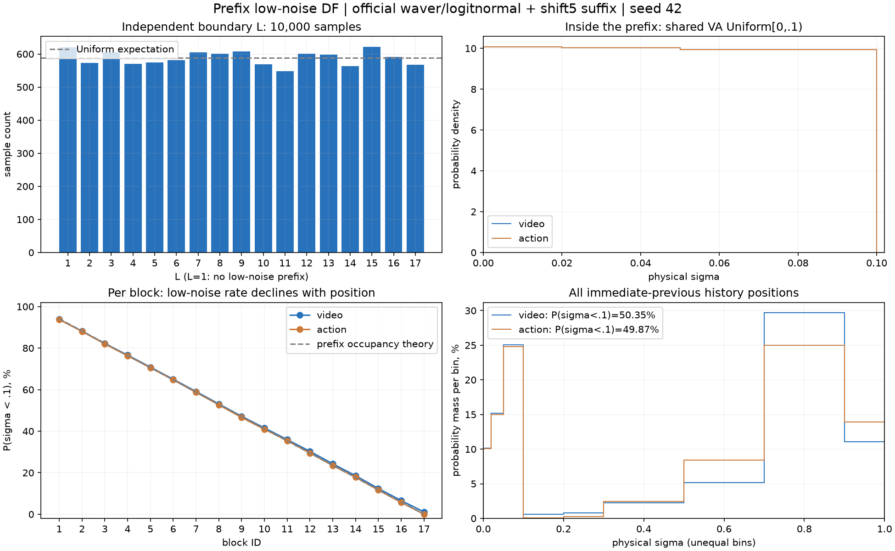
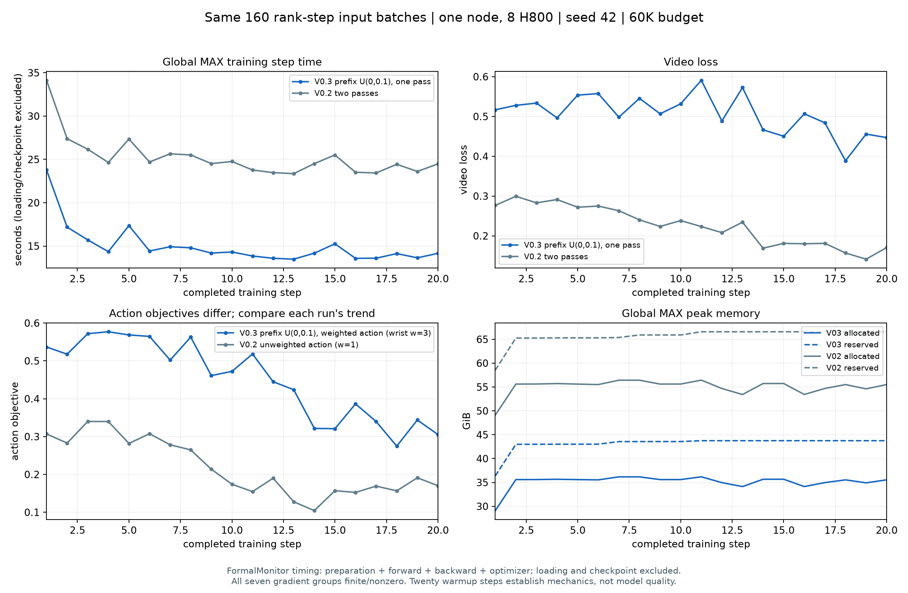
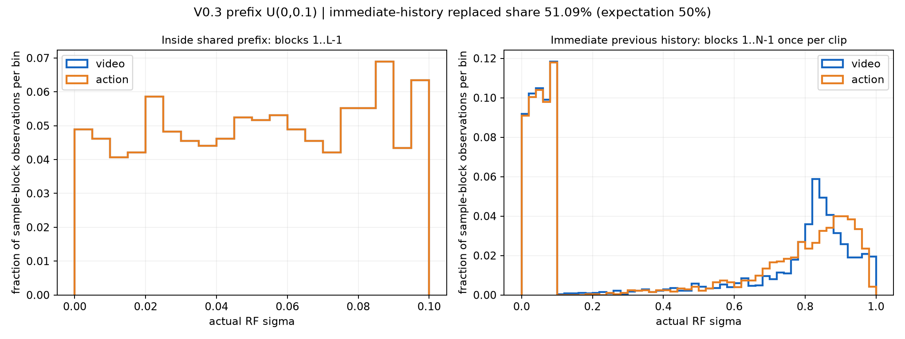
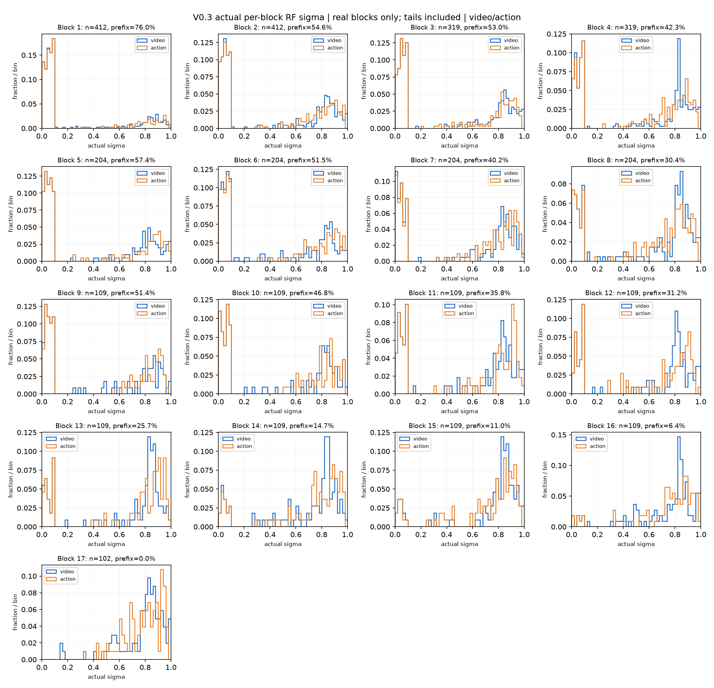

# AR V0.3.0 实验记录

## 1. 范围与版本

本轮依据本地同步的 `docs/ar_v0.3/design.md`，仅改变学习率/调度、单遍 diffusion forcing、57D 手腕通道权重。V0.2 文件保持不动；57D/PCA15、C4/K8/H15、混合 clip 档位、60K token 预算、数据/normalizer/codec、联合推理 30 步沿用。

- 核心实现 commit：`2cf54ed`，已 push 到 `origin/ar-video-action`。
- 注册名：`rbs_wam_ar_v0_3_diffusion_forcing_wrist_weight_v1`。
- 新训练入口：`cosmos3_joint_video_hand_pose/scripts/launch_ar_v0_3.sh`；官方 Cosmos CLI / Trainer / optimizer / scheduler / checkpoint / W&B 保留。
- 同步设计 SHA256：`68b2e84afcb6da32f1dc550aae09946cfe7a28e83b85deab05ec3f1d1e87481b`。腕部加权占比按修正后的 58%，即 54/93。

## 2. 学习率回执

全模型峰值 `1e-4`，五个 action/condition 模块倍率均为 1。官方 `LambdaCosine`：warmup 100，cycle_lengths=[3000]，f_start=0，f_max=1，f_min=0.3。正式 max_iter=3000、save_iter=500。官方周期长度包含 warmup；CLI 最终配置在 optimizer 初始化前断言并打印/保存回执。

| step | 理论 LR |
|---:|---:|
| 0 | 0 |
| 100 | 1e-4 |
| 1500 | 6.689486180048961e-5 |
| 3000 | 3e-5 |

## 3. CPU / GPU 验证

回执目录：`outputs/maintenance/ar_v03_implementation_20261002/`。测试均在远端 `lzh`、`cosmos3` 环境（torch 2.10.0+cu128）执行。GPU 测试前确认 Tdebug6 无 compute 进程，再分别使用空闲 GPU0/1/2。

- CPU 主套件：62 passed、1 CUDA skipped（`all_cpu.log`）；eval metadata 新补 1 项后专项 22 passed；短测 callback 专项 8 passed（`smoke_monitor_cpu.log`）。
- 全 1 通道权重 loss / 梯度 / metrics 与 V0.2 精确一致；非均匀权重的 mask/分母/字段未加权日志通过。loss CUDA 专项 19 passed（包含 CPU 项及 1 CUDA 项，`loss_gpu.log`）。
- Attention CPU 7 项、CUDA 5 项通过：单遍 mask 与 V0.2 clean mask 等价；块因果、H15、样本隔离、U/S 条件隔离及 FP32/BF16 梯度。
- 官方完整小网络 GPU 2 项通过（`network_gpu.log`）：真实 training_step 只调用一次 net，所有梯度有限；8 个字段日志为未加权值；无 clean KV 保留。
- Refresh CPU 专项 22 项、官方小网络/KVCache CUDA 2 项通过：sigma_small=0 与原始输出/缓存逐位一致；非零 refresh 同时作用于历史 V/A，U/S 和当前预测不变，后续块受影响；C4 尾块通过。
- `py_compile`、启动脚本 `bash -n` 通过。环境没有 ruff，不宣称执行过 lint。

用户补充的 noisy 块历史梯度：补强 GPU 小网络测试，真实 V0.3 sampler→官方加噪/replace 路径，使用 detached 的真实 flow target eps-x0 和腕权3的按块MSE；同时验证U/S不加噪、V/A逐块timestep正确。对完全相同的3次完整小网络前向分别反传本块 loss、后续块 loss、两者之和，避免编译 attention 的 donated-buffer 对 retain_graph 限制。块 k 的带噪视频和 action 输入收到两条路径的非零梯度，合并梯度等于各路径之和；未来块梯度严格为0。两项GPU专项通过（24.70秒，`network_noised_flow_gpu.log/.exit`）；数值如下，覆盖实际噪声/目标，替代早期纯输出平方的结构探针。

| 完整网络 FP32 输入 | 自身块 loss 梯度 L2 | 后续块 loss 梯度 L2 |
|---|---:|---:|
| 块 k 视频 | 0.1063752770 | 0.0005127163022 |
| 块 k action | 0.08426816016 | 0.002601672197 |

两层 attention CUDA 对照也在 FP32/BF16 验证了自身/后续/合并梯度，以及 U/S 不通过历史读取、块17 H15淘汰和跨样本零梯度。

这里的按块路径探针使用官方完整小网络夹具；20步真实Nano短测另验证每步仅1次前向和7模块组raw梯度全部有限非零，未在Nano短测上额外执行两次按块backward，因此不把小网络数值冒充Nano每块梯度范数。

## 4. 单节点 20 步与 V0.2 两遍对照

状态：V0.3 与 V0.2 各20/20、exit=0，官方 step20 DCP 均保存成功（25.35/26.25秒）。正式训练尚未启动，须先向用户交付短测结果并获确认。

- 节点 Tdebug4：8×H800（约79.6 GiB/卡），CPU quota 120 核、affinity 200 核，启动检查 MemAvailable 约1.37 TiB、GPU 无 compute 进程。GPU 任务逐组串行；不抢占其他进程。
- 独立比较目录：`outputs/maintenance/ar_v03_short_compare_20261001T163632/`（目录采用服务器 UTC 时间；日志采用服务器本地时间）。
- V0.3 与 V0.2 各20步，shard8/replicate1/CP1、seed42、同一官方 Nano 起点。V0.2 使用保留的 `ar_v0_2_video_lr1e4.toml`，只在 CLI 覆盖 cycle3000/f_min0.3/max_iter20/save20/replicate1 与短测 job 名称。
- 两组最终 dataloader_train/val、optimizer、scheduler、checkpoint 配置完全相同。实际窗口身份逐 rank/step hash 验证后才比较耗时。
- 仅此短测 CLI 和环境使用 W&B disabled；正式 V0.3 TOML/注册保持 online。
- 新 `ARV03SmokeMonitor` 只读诊断：计数 training_step 前向（排除 backward checkpoint 重算），记录7个模块组的 raw finite/nonzero 梯度和官方 preclip norm、窗口身份、GPU峰值与 step 时间。
- step 时间包含模型准备、forward/backward、optimizer/scheduler/zero_grad；不含 dataloader/H2D/checkpoint。梯度诊断开销单独记录。报告首步/JIT与稳态均值，不能用小网络耗时替代正式 Nano 的实测。
- launcher：`cosmos3_joint_video_hand_pose/scripts/ar_v03_short_compare.sh`，分别参数 `v03` / `v02`，两次共用 `COMPARE_ROOT`。会拒绝已有 started.txt 的重复任务及有 compute 进程的节点。

### V0.3 实际短测结果

`v03-summary.json` 与8份 `smoke_monitor_rank*.jsonl`、`formal_monitor.jsonl` 是结果来源。20步均完成，8rank×20次前向数全部为1，7组 raw 梯度全部 finite/nonzero，全部 stop_reason=null。五档 clip 全部被实际采样，20步共412 clips；没有改变数据预算或重算统计。

| 计时范围（global max，含 optimizer，不含 dataloader/H2D/checkpoint） | 均值秒/步 | 中位数秒/步 |
|---|---:|---:|
| 首步 | 25.756 | 25.756 |
| 全20步 | 15.148 | 14.219 |
| steps6–20 | 14.145 | 14.167 |

全程峰值 allocated/reserved：36.180/43.750 GiB/卡；后15步开始驻留15.169–15.202 GiB，未出现连续泄漏趋势。早期4/20步触发clip，预热期未据此误触发正式9/10停止规则。

| V0.3 loss（正式 monitor 归约） | 首5步均值 | 末5步均值 | 降幅 |
|---|---:|---:|---:|
| video | .301350 | .194561 | 35.44% |
| action（腕部加权目标） | .322673 | .166291 | 48.46% |
| total | .624023 | .360851 | 42.17% |

8字段继续记录未加权原值；action总目标含新权重，不能直接把它与V0.2未加权总action loss数值当成效果对照。20步使用100步warmup的前段，只证明训练链路和初期数值正常，不替代正式heldout评测。

真实新 checkpoint：比较目录下 `joint_video_hand_pose/ar_v0_3_short_compare/v03/checkpoints/iter_000000020/model/`。CPU仅读取metadata与小型contract extra_state，确认886个DCP键、五模块完整、normalizer/codec/manifest绑定与snapshot一致，官方TOML可compose为V0.3模型；未进行真实Nano GPU重载或checkpoint推理。评测应显式使用该model子目录及新TOML，并记录伴随snapshot的版本来源：旧contract本身不区分TF/DF。

- snapshot SHA256：`a69ece544d0379885735fa3418ba14ec65b67cd8b0faa3eebe905b5d640e3887`。
- DCP metadata SHA256：`2a0c80bb1d80a3c5b137ec51325f78b0727153e4f73d23da04a697461b6a5cde`。
- 完整检查回执：比较目录下 `checkpoint_validation.json`，明确检查范围为metadata/contract-only。

### V0.2 两遍公平耗时对照

比较目录下 `analyze_compare.py` 在两组正常退出后读取全部20步和8rank日志；任何缺记录、输入身份不等、forward次数不为1/2、7组梯度不finite/nonzero或stop_reason非空均拒绝生成报告。本次160组rank/step的窗口/源帧/数据绑定/packing身份全部一致，两组各412 clips，五档均覆盖。身份核对是已记录的batch metadata/hash核对，不宣称比较了整个输入张量的逐位值。

| 观测指标 | V0.2 两遍 | V0.3 单遍 | V0.3 相对变化 |
|---|---:|---:|---:|
| 每步 net 前向数（不含 backward 重算） | 2 | 1 | -50% |
| 首步秒/步 | 34.130 | 25.756 | -24.54% |
| 全20步均值秒/步 | 25.248 | 15.148 | -40.00%（1.67×） |
| steps6–20均值秒/步 | 24.350 | 14.145 | -41.91%（1.72×） |
| steps6–20中位数秒/步 | 24.478 | 14.167 | -42.13% |
| 全程峰值 allocated GiB/卡 | 56.442 | 36.180 | -35.90% |
| 全程峰值 reserved GiB/卡 | 66.576 | 43.750 | -34.29% |

两组计时均来自沿用的 `FormalTrainingMonitor`（各rank最大值），包含短测只读梯度/身份诊断；两组诊断采用相同代码，不包含dataloader/H2D、权重加载、checkpoint保存。首步包含首次训练编译/初始化，steps6–20仅用于这次混合数据20步中避开前期编译的比较，不能据此保证正式双节点的固定速度。

完整8字段及两模态首末5步、分阶段统计、identity hashes和硬件信息见 [short_compare_receipt.json](short_compare_receipt.json)，源日志保留在比较目录，不覆盖V0.2正式实验。下图action两组目标不同，展示各自初期下降趋势，不用于判定模型质量优劣。

## 5. 正式训练与评测待办

用户确认短测后，重新检查实时资源，选两台空闲节点 HSDP 8×2，跨节点 NCCL 内网 TCP；在线 W&B 启动前核验最终配置/环境，启动后通过 API 核实 step/loss 已上传并记录当前 run 链接。沿用 `FormalTrainingMonitor` 与 `StopPolicy`，不改变 OOM 停止规则/预算，不擅自重启。

2026-10-02用户追加推理扫描：step 500/1000/2000/3000 每次 heldout8 gt/generated +固定训练16 gt，各扫 sigma_small={.02,.05,.1}，每checkpoint共96份。冻结清单hash、320×180整体光流余弦，以及 V0.2 step1000 / lr1e-4 同表方案见 `evaluation_plan.md`。未运行的训练/评测不填虚构结果。

以下旧值直接读取 `outputs/maintenance/video_lr_eval_extended_20261001T2229/metrics/` 的 `baseline_{gt,generated}.json`、`lr1000_{gt,generated}.json`、`lr1000_train16_gt.json`，均为17块整体累加的320×180光流口径。V0.3未来每个checkpoint按同一split/mode追加行；旧sigma=0与V0.3主sigma=.02明确区分。未混用旧逐像素余弦数字。

| 模型 / step | split / 窗口数 | 历史模式 | 历史 sigma | 幅值比 | 整体方向余弦 |
|---|---|---|---:|---:|---:|
| V0.2 lr2e-5 / 1000 | heldout / 8 | gt | 0 | 1.077061 | 0.103794 |
| V0.2 lr2e-5 / 1000 | heldout / 8 | generated | 0 | 1.644089 | -0.016639 |
| V0.2 lr1e-4 / 1000 | heldout / 8 | gt | 0 | 1.073728 | 0.035371 |
| V0.2 lr1e-4 / 1000 | heldout / 8 | generated | 0 | 1.737592 | 0.015020 |
| V0.2 lr1e-4 / 1000 | train / 16 | gt | 0 | 0.814540 | 0.182111 |
| V0.3 / 500、1000、2000、3000 | heldout / 8 | gt | .02 | 待评测 | 待评测 |
| V0.3 / 500、1000、2000、3000 | heldout / 8 | generated | .02 | 待评测 | 待评测 |
| V0.3 / 500、1000、2000、3000 | train / 16 | gt | .02 | 待评测 | 待评测 |

## 6. Review 后修订：前缀低噪声 DF

用户review已核对基础三项实现（单遍/梯度/mask/加权/refresh/LR回执），但原waver+shift5历史常为重度加噪，与推理小sigma历史覆盖不足。因此正式训练前必须使用随机低噪声前缀；以最新用户指令及 design §2.5 为准。

最终公式：每sample的真实n_chunks上抽L均匀1..n；块<L的V/A共享每块Uniform[0,sigma_hist_max)低σ，默认histmax=.1；块≥L保持原视频waver/actionlogitnormal +shift5抽样，独立generator不改变原随机顺序，U/S0、全部未来块loss保留。默认开，关闭逐位复现此前V0.3。此前建议.5·u²已被用户更正，不做实现配方。

本节新结果对应新采样，不能把第4节原采样20步视为最终默认配方短测。原结果完整保留作历史记录。

- 实现 commit：`31206d7`，已 push。新增独立 CPU generator，以 seed/optimizer iteration/DP rank/sample ordinal 的稳定哈希派生；相同拓扑、packing 与 iteration 可复现，未宣称弹性 world-size 重排等价。
- 新CPU/GPU/10k统计回执：`outputs/maintenance/ar_v03_prefix_implementation_20261002/`。CPU regression 43 passed/1 CUDA skipped，sigma 专项12 passed，config/monitor 专项25 passed；原生 CLI dryrun exit=0，最终配置默认 prefix=True/histmax=.1，并支持 CLI 关闭/覆盖。
- 前缀开/关均覆盖官方小网络真实 GPU training_step 与 noisy flow target 自身/后续/合并梯度，共4 passed（35.04秒）。GPU 前核查 Tdebug6，无其他 compute 进程；使用空闲GPU2。关闭前缀时原有 sigma、timestep 和后续随机数逐位一致；启用时后缀抽样不变，U/S=0，物理sigma直接路由到flow timestep，未重复shift。
- 新20步目录：`outputs/maintenance/ar_v03_prefix_short_20261001T172706/`。实时确认空闲的 Tdebug4（8×H800、CPU quota120、MemAvailable约1.37TiB）上已完成20/20、exit=0；官方step20 DCP保存25.25秒。
- 性能参考直接复用第4节已完成的同机V0.2真实20步，路径在新目录 `v02_reference.json` 明确记录，不复制冒充新训练。两组最终输入身份仍须逐rank/step重新相等后才比较；不相等则不报公平速度结论。
- 新20步checkpoint会先做heldout8 gt/generated三σ扫描，24任务/48NPZ。按固定清单拆成单窗，先一个固定窗口三σpilot（6NPZ）验证完整17块及吞吐，再用空闲GPU并行其余21任务；不减少8窗口。用户已确认短测和正式checkpoint均扫三档；正式每checkpoint96份。
- 10k直方图及短测实际σ都分三口径：前缀内、逐块、所有后继块的紧前历史位置（排除各样本末块）。前缀内100%<.1，历史汇总约50%加原分布低σ；逐块比例不应固定50%。
- 正式训练尚未启动。修订后的短测/σ扫描结果须给用户确认，再进入正式HSDP/W&B online阶段。

### 6.1 10,000样本 sigma 直方图

使用真实官方视频 waver/action logitnormal +shift5 后缀，seed42、iteration12、rank0，每sample17块。完整回执为 [prefix_sigma_10000.json](prefix_sigma_10000.json)，SHA256 `3ff2b6db40cfeefcd9117849c50bc67947f95b69d4edb91bf09b6a8dd2191ff8`。L各档548–622个样本，前缀占紧前历史位置49.861875%。每个query块2..17只计其紧前一块一次，排除各sample末块；不按H15的所有可见pair重复计权。

| 统计口径 | 模态 | P(sigma<.02) | P(sigma<.05) | P(sigma<.1) |
|---|---|---:|---:|---:|
| 前缀内 | video/action（共享抽样） | 20.158% | 50.258% | 100% |
| 全体紧前历史位置 | video | 10.134% | 25.293% | 50.348% |
| 全体紧前历史位置 | action | 10.051% | 25.059% | 49.867% |

逐块P(sigma<.1)如下；前面的块更可能处于随机前缀，末块不可能在前缀内，因此不能要求每个块各自约50%。

| 块 | video % | action % |
|---:|---:|---:|
| 1 | 93.85 | 93.79 |
| 2 | 88.15 | 88.06 |
| 3 | 82.17 | 82.01 |
| 4 | 76.63 | 76.30 |
| 5 | 70.82 | 70.56 |
| 6 | 65.00 | 64.75 |
| 7 | 59.10 | 58.70 |
| 8 | 53.13 | 52.69 |
| 9 | 47.18 | 46.61 |
| 10 | 41.55 | 40.92 |
| 11 | 35.94 | 35.45 |
| 12 | 30.26 | 29.45 |
| 13 | 24.26 | 23.46 |
| 14 | 18.54 | 17.82 |
| 15 | 12.38 | 11.61 |
| 16 | 6.60 | 5.69 |
| 17 | 1.10 | .01 |

附录口径：按H15全部可见历史pair重复计权时，video/action低噪声比例为64.665%/64.322%；它不是用户指定的紧前一块约50%验收口径。

### 6.2 新配方真实 Nano 20步

新run UTC 17:39:56–17:48:12（服务器日志为Shanghai 01:39–01:48）。新目录下 `analyze_compare.py` 读取已完成的新20步及第4节原V0.2真实20步；两个run均exit0，重新核对全部160组rank/step窗口身份和packing metadata相同，412 clips、五档clip均覆盖。160次记录均为单遍1次net前向（V0.2为2次）；7组 raw 梯度全部finite/nonzero，全部stop_reason=null。不是重新运行V0.2，也未复制旧log伪装新run。

| 指标 | 原V0.2两遍 | 新前缀V0.3单遍 | 相对变化 |
|---|---:|---:|---:|
| 首步秒/步 | 34.130 | 23.779 | -30.33% |
| 全20步均值秒/步 | 25.248 | 15.026 | -40.49%（1.68×） |
| steps6–20均值秒/步 | 24.350 | 14.142 | -41.92%（1.72×） |
| steps6–20中位数秒/步 | 24.478 | 14.155 | -42.17% |
| 全程峰值 allocated GiB/卡 | 56.442 | 36.180 | -35.90% |
| 全程峰值 reserved GiB/卡 | 66.576 | 43.750 | -34.29% |

计时沿用第4节的模型准备、forward/backward、optimizer/scheduler/zero_grad口径，包含只读诊断，不含dataloader/H2D/checkpoint。第20步官方iter_speed包含25.25秒保存，表内用FormalTrainingMonitor排除保存的14.155秒；不混用两种计时。

| 新前缀V0.3 loss | 首5步均值 | 末5步均值 | 降幅 |
|---|---:|---:|---:|
| video | .525698 | .456431 | 13.18% |
| action（腕权3目标） | .554329 | .330059 | 40.46% |
| total | 1.080027 | .786490 | 27.18% |

低σ会改变训练目标难度，不能拿第4节原高σ的loss绝对值直接作质量比较。8字段仍为未加权原值，完整值见回执。16/20步触发clip，处于100步warmup内，按既定规则不触发正式post-warmup 9/10停止判定；该现象已记录，正式训练不放宽阈值。

实际加噪回执：412 samples、3252真实future blocks；前缀1451块，共享V/A σ中位数.052998、最大.09999790、100%<.1。全部3252个U和3252个S的sigma均为0。2840个紧前历史位置中，前缀替换占51.0915%（理论50%，有限样本z=.543）；video实际sigma≤.1为51.6197%，action为51.0915%，差异来自原后缀偶然低σ。

| 实际短测逐块口径 | 样本数 | video sigma≤.1 % | action sigma≤.1 % |
|---:|---:|---:|---:|
| 1 | 412 | 76.21 | 75.97 |
| 2 | 412 | 55.10 | 54.61 |
| 3 | 319 | 52.98 | 52.98 |
| 4 | 319 | 42.95 | 42.32 |
| 5 | 204 | 57.35 | 57.35 |
| 6 | 204 | 53.92 | 51.47 |
| 7 | 204 | 41.67 | 40.20 |
| 8 | 204 | 30.88 | 30.39 |
| 9 | 109 | 52.29 | 51.38 |
| 10 | 109 | 46.79 | 46.79 |
| 11 | 109 | 35.78 | 35.78 |
| 12 | 109 | 31.19 | 31.19 |
| 13 | 109 | 26.61 | 25.69 |
| 14 | 109 | 15.60 | 14.68 |
| 15 | 109 | 11.93 | 11.01 |
| 16 | 109 | 6.42 | 6.42 |
| 17 | 102 | 0 | 0 |

实际短测混合2/4/8/16/17块样本，逐块表随短clip退出改变分母，所以不像6.1固定17块统计严格递减。直方图按真实加噪sigma生成，排除slot0/pad和重复H15pair；不是按理论抽样替代监控。

完整回执：[prefix_short_receipt.json](prefix_short_receipt.json)。

