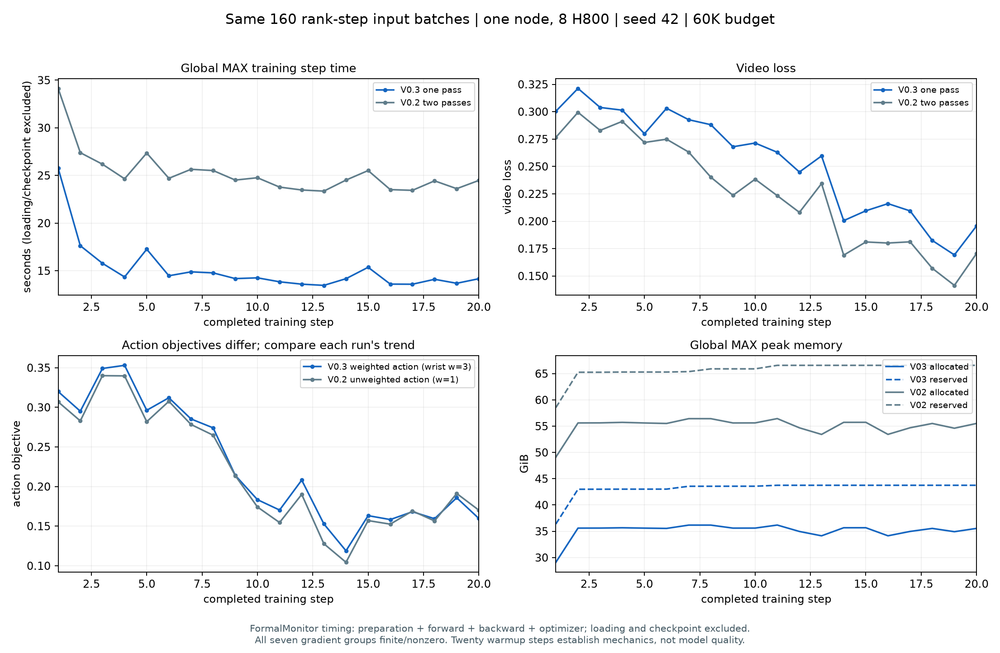

# AR V0.3.0 实验记录

## 1. 范围与版本

本轮依据本地同步的 `docs/ar_v0.3/design.md`，仅改变学习率/调度、单遍 diffusion forcing、57D 手腕通道权重。V0.2 文件保持不动；57D/PCA15、C4/K8/H15、混合 clip 档位、60K token 预算、数据/normalizer/codec、联合推理 30 步沿用。

- 核心实现 commit：`2cf54ed`，已 push 到 `origin/ar-video-action`。
- 注册名：`rbs_wam_ar_v0_3_diffusion_forcing_wrist_weight_v1`。
- 新训练入口：`cosmos3_joint_video_hand_pose/scripts/launch_ar_v0_3.sh`；官方 Cosmos CLI / Trainer / optimizer / scheduler / checkpoint / W&B 保留。
- 同步设计 SHA256：`68b2e84afcb6da32f1dc550aae09946cfe7a28e83b85deab05ec3f1d1e87481b`。腕部加权占比按修正后的 58%，即 54/93。

## 2. 学习率回执

全模型峰值 `1e-4`，五个 action/condition 模块倍率均为 1。官方 `LambdaCosine`：warmup 100，cycle_lengths=[3000]，f_start=0，f_max=1，f_min=0.3。正式 max_iter=3000、save_iter=500。官方周期长度包含 warmup；CLI 最终配置在 optimizer 初始化前断言并打印/保存回执。

| step | 理论 LR |
|---:|---:|
| 0 | 0 |
| 100 | 1e-4 |
| 1500 | 6.689486180048961e-5 |
| 3000 | 3e-5 |

## 3. CPU / GPU 验证

回执目录：`outputs/maintenance/ar_v03_implementation_20261002/`。测试均在远端 `lzh`、`cosmos3` 环境（torch 2.10.0+cu128）执行。GPU 测试前确认 Tdebug6 无 compute 进程，再分别使用空闲 GPU0/1/2。

- CPU 主套件：62 passed、1 CUDA skipped（`all_cpu.log`）；eval metadata 新补 1 项后专项 22 passed；短测 callback 专项 8 passed（`smoke_monitor_cpu.log`）。
- 全 1 通道权重 loss / 梯度 / metrics 与 V0.2 精确一致；非均匀权重的 mask/分母/字段未加权日志通过。loss CUDA 专项 19 passed（包含 CPU 项及 1 CUDA 项，`loss_gpu.log`）。
- Attention CPU 7 项、CUDA 5 项通过：单遍 mask 与 V0.2 clean mask 等价；块因果、H15、样本隔离、U/S 条件隔离及 FP32/BF16 梯度。
- 官方完整小网络 GPU 2 项通过（`network_gpu.log`）：真实 training_step 只调用一次 net，所有梯度有限；8 个字段日志为未加权值；无 clean KV 保留。
- Refresh CPU 专项 22 项、官方小网络/KVCache CUDA 2 项通过：sigma_small=0 与原始输出/缓存逐位一致；非零 refresh 同时作用于历史 V/A，U/S 和当前预测不变，后续块受影响；C4 尾块通过。
- `py_compile`、启动脚本 `bash -n` 通过。环境没有 ruff，不宣称执行过 lint。

用户补充的 noisy 块历史梯度：补强 GPU 小网络测试，真实 V0.3 sampler→官方加噪/replace 路径，使用 detached 的真实 flow target eps-x0 和腕权3的按块MSE；同时验证U/S不加噪、V/A逐块timestep正确。对完全相同的3次完整小网络前向分别反传本块 loss、后续块 loss、两者之和，避免编译 attention 的 donated-buffer 对 retain_graph 限制。块 k 的带噪视频和 action 输入收到两条路径的非零梯度，合并梯度等于各路径之和；未来块梯度严格为0。两项GPU专项通过（24.70秒，`network_noised_flow_gpu.log/.exit`）；数值如下，覆盖实际噪声/目标，替代早期纯输出平方的结构探针。

| 完整网络 FP32 输入 | 自身块 loss 梯度 L2 | 后续块 loss 梯度 L2 |
|---|---:|---:|
| 块 k 视频 | 0.1063752770 | 0.0005127163022 |
| 块 k action | 0.08426816016 | 0.002601672197 |

两层 attention CUDA 对照也在 FP32/BF16 验证了自身/后续/合并梯度，以及 U/S 不通过历史读取、块17 H15淘汰和跨样本零梯度。

这里的按块路径探针使用官方完整小网络夹具；20步真实Nano短测另验证每步仅1次前向和7模块组raw梯度全部有限非零，未在Nano短测上额外执行两次按块backward，因此不把小网络数值冒充Nano每块梯度范数。

## 4. 单节点 20 步与 V0.2 两遍对照

状态：V0.3 与 V0.2 各20/20、exit=0，官方 step20 DCP 均保存成功（25.35/26.25秒）。正式训练尚未启动，须先向用户交付短测结果并获确认。

- 节点 Tdebug4：8×H800（约79.6 GiB/卡），CPU quota 120 核、affinity 200 核，启动检查 MemAvailable 约1.37 TiB、GPU 无 compute 进程。GPU 任务逐组串行；不抢占其他进程。
- 独立比较目录：`outputs/maintenance/ar_v03_short_compare_20261001T163632/`（目录采用服务器 UTC 时间；日志采用服务器本地时间）。
- V0.3 与 V0.2 各20步，shard8/replicate1/CP1、seed42、同一官方 Nano 起点。V0.2 使用保留的 `ar_v0_2_video_lr1e4.toml`，只在 CLI 覆盖 cycle3000/f_min0.3/max_iter20/save20/replicate1 与短测 job 名称。
- 两组最终 dataloader_train/val、optimizer、scheduler、checkpoint 配置完全相同。实际窗口身份逐 rank/step hash 验证后才比较耗时。
- 仅此短测 CLI 和环境使用 W&B disabled；正式 V0.3 TOML/注册保持 online。
- 新 `ARV03SmokeMonitor` 只读诊断：计数 training_step 前向（排除 backward checkpoint 重算），记录7个模块组的 raw finite/nonzero 梯度和官方 preclip norm、窗口身份、GPU峰值与 step 时间。
- step 时间包含模型准备、forward/backward、optimizer/scheduler/zero_grad；不含 dataloader/H2D/checkpoint。梯度诊断开销单独记录。报告首步/JIT与稳态均值，不能用小网络耗时替代正式 Nano 的实测。
- launcher：`cosmos3_joint_video_hand_pose/scripts/ar_v03_short_compare.sh`，分别参数 `v03` / `v02`，两次共用 `COMPARE_ROOT`。会拒绝已有 started.txt 的重复任务及有 compute 进程的节点。

### V0.3 实际短测结果

`v03-summary.json` 与8份 `smoke_monitor_rank*.jsonl`、`formal_monitor.jsonl` 是结果来源。20步均完成，8rank×20次前向数全部为1，7组 raw 梯度全部 finite/nonzero，全部 stop_reason=null。五档 clip 全部被实际采样，20步共412 clips；没有改变数据预算或重算统计。

| 计时范围（global max，含 optimizer，不含 dataloader/H2D/checkpoint） | 均值秒/步 | 中位数秒/步 |
|---|---:|---:|
| 首步 | 25.756 | 25.756 |
| 全20步 | 15.148 | 14.219 |
| steps6–20 | 14.145 | 14.167 |

全程峰值 allocated/reserved：36.180/43.750 GiB/卡；后15步开始驻留15.169–15.202 GiB，未出现连续泄漏趋势。早期4/20步触发clip，预热期未据此误触发正式9/10停止规则。

| V0.3 loss（正式 monitor 归约） | 首5步均值 | 末5步均值 | 降幅 |
|---|---:|---:|---:|
| video | .301350 | .194561 | 35.44% |
| action（腕部加权目标） | .322673 | .166291 | 48.46% |
| total | .624023 | .360851 | 42.17% |

8字段继续记录未加权原值；action总目标含新权重，不能直接把它与V0.2未加权总action loss数值当成效果对照。20步使用100步warmup的前段，只证明训练链路和初期数值正常，不替代正式heldout评测。

真实新 checkpoint：比较目录下 `joint_video_hand_pose/ar_v0_3_short_compare/v03/checkpoints/iter_000000020/model/`。CPU仅读取metadata与小型contract extra_state，确认886个DCP键、五模块完整、normalizer/codec/manifest绑定与snapshot一致，官方TOML可compose为V0.3模型；未进行真实Nano GPU重载或checkpoint推理。评测应显式使用该model子目录及新TOML，并记录伴随snapshot的版本来源：旧contract本身不区分TF/DF。

- snapshot SHA256：`a69ece544d0379885735fa3418ba14ec65b67cd8b0faa3eebe905b5d640e3887`。
- DCP metadata SHA256：`2a0c80bb1d80a3c5b137ec51325f78b0727153e4f73d23da04a697461b6a5cde`。
- 完整检查回执：比较目录下 `checkpoint_validation.json`，明确检查范围为metadata/contract-only。

### V0.2 两遍公平耗时对照

比较目录下 `analyze_compare.py` 在两组正常退出后读取全部20步和8rank日志；任何缺记录、输入身份不等、forward次数不为1/2、7组梯度不finite/nonzero或stop_reason非空均拒绝生成报告。本次160组rank/step的窗口/源帧/数据绑定/packing身份全部一致，两组各412 clips，五档均覆盖。身份核对是已记录的batch metadata/hash核对，不宣称比较了整个输入张量的逐位值。

| 观测指标 | V0.2 两遍 | V0.3 单遍 | V0.3 相对变化 |
|---|---:|---:|---:|
| 每步 net 前向数（不含 backward 重算） | 2 | 1 | -50% |
| 首步秒/步 | 34.130 | 25.756 | -24.54% |
| 全20步均值秒/步 | 25.248 | 15.148 | -40.00%（1.67×） |
| steps6–20均值秒/步 | 24.350 | 14.145 | -41.91%（1.72×） |
| steps6–20中位数秒/步 | 24.478 | 14.167 | -42.13% |
| 全程峰值 allocated GiB/卡 | 56.442 | 36.180 | -35.90% |
| 全程峰值 reserved GiB/卡 | 66.576 | 43.750 | -34.29% |

两组计时均来自沿用的 `FormalTrainingMonitor`（各rank最大值），包含短测只读梯度/身份诊断；两组诊断采用相同代码，不包含dataloader/H2D、权重加载、checkpoint保存。首步包含首次训练编译/初始化，steps6–20仅用于这次混合数据20步中避开前期编译的比较，不能据此保证正式双节点的固定速度。

完整8字段及两模态首末5步、分阶段统计、identity hashes和硬件信息见 [short_compare_receipt.json](short_compare_receipt.json)，源日志保留在比较目录，不覆盖V0.2正式实验。下图action两组目标不同，展示各自初期下降趋势，不用于判定模型质量优劣。

## 5. 正式训练与评测待办

用户确认短测后，重新检查实时资源，选两台空闲节点 HSDP 8×2，跨节点 NCCL 内网 TCP；在线 W&B 启动前核验最终配置/环境，启动后通过 API 核实 step/loss 已上传并记录当前 run 链接。沿用 `FormalTrainingMonitor` 与 `StopPolicy`，不改变 OOM 停止规则/预算，不擅自重启。

step 500/1000/2000/3000 每次 heldout8 gt/generated（sigma_small=.02）+固定训练16 gt。全部32窗口、冻结清单hash、320×180整体光流余弦，以及 V0.2 step1000 / lr1e-4 同表方案见 `evaluation_plan.md`。未运行的训练/评测不填虚构结果。

以下旧值直接读取 `outputs/maintenance/video_lr_eval_extended_20261001T2229/metrics/` 的 `baseline_{gt,generated}.json`、`lr1000_{gt,generated}.json`、`lr1000_train16_gt.json`，均为17块整体累加的320×180光流口径。V0.3未来每个checkpoint按同一split/mode追加行；旧sigma=0与V0.3主sigma=.02明确区分。未混用旧逐像素余弦数字。

| 模型 / step | split / 窗口数 | 历史模式 | 历史 sigma | 幅值比 | 整体方向余弦 |
|---|---|---|---:|---:|---:|
| V0.2 lr2e-5 / 1000 | heldout / 8 | gt | 0 | 1.077061 | 0.103794 |
| V0.2 lr2e-5 / 1000 | heldout / 8 | generated | 0 | 1.644089 | -0.016639 |
| V0.2 lr1e-4 / 1000 | heldout / 8 | gt | 0 | 1.073728 | 0.035371 |
| V0.2 lr1e-4 / 1000 | heldout / 8 | generated | 0 | 1.737592 | 0.015020 |
| V0.2 lr1e-4 / 1000 | train / 16 | gt | 0 | 0.814540 | 0.182111 |
| V0.3 / 500、1000、2000、3000 | heldout / 8 | gt | .02 | 待评测 | 待评测 |
| V0.3 / 500、1000、2000、3000 | heldout / 8 | generated | .02 | 待评测 | 待评测 |
| V0.3 / 500、1000、2000、3000 | train / 16 | gt | .02 | 待评测 | 待评测 |
